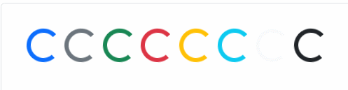
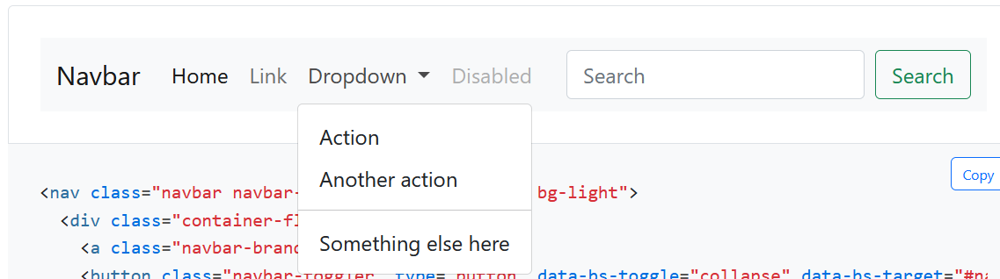
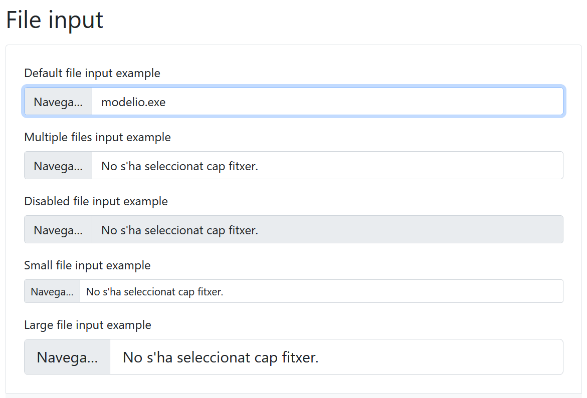
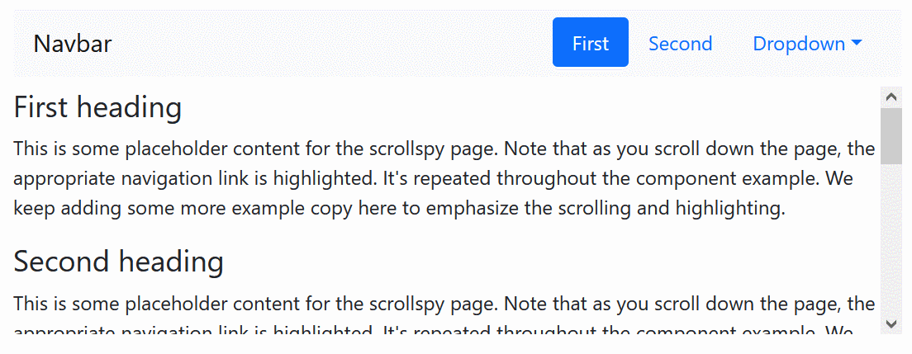

# 16BoostrapYValidaciones

## 1.Parte 1. Investigación
Crea una presentación de bootstrap que solvente las siguientes cuestiones:

### ¿Qué es Bootstrap?
Bootsrap es un framework front-end gratuito para un desarrollo web más rápido y facil.
Incluye clases y funcionalidades agrupadas en forma de componentes.

### ¿Para qué sirve?
Bootstrap incluye plantillas de diseño basadas en HTML y CSS para tipografía,formulario, botones, tablas, navegación, modales, carruseles de imágenes y muchos otros, así como complementos de JavaScript opcionales.

Bootstrap también brinda la capacidad de crear fácilmente diseños adaptables.

### ¿Por qué usar Bootstrap?
Bootstrap es fácil de usar, cualquier persona con conocimiento básico de HTML y CSS puede comenzar a usar Bootstrap.
También facilita realizar webs de diseño agradable más rápidamente.

### Características de Bootstrap
* Incluye muchas clases y componentes predefinidos
* Está diseñado mobile-first
* Es fácil elaborar webs adaptables (responsive)

### Ventajas de usar bootstrap
* Es adaptable: el CSS receptivo de Bootstrap se ajusta a teléfonos, tabletas y computadoras de escritorio.
* En Bootstrap, los estilos móviles primero son parte del marco central.
* Bootstrap 5 es compatible con todos los navegadores modernos (Chrome, Firefox, Edge, Safari y Opera).

### Desventajas de usar bootstrap
* Se recomienda trabajar con Bootstrap desde el inicio de un proyecto, ya que si quieres incluir el framework en un trabajo ya iniciado algunos estilos podrían "romperse" y se tendría que ajustar a como se tenía en un principio, y eso puede ser un poco tedioso y molesto.
* Es complicado cambiar de versión si has realizado modificaciones profundas.
* No es ligero, y además, para algunas funcionalidades, será necesario tener que usar JavaScript.
* Debes adaptar tu diseño a un grid de 12 columnas, que se modifican según el dispositivo.Aquí empiezan los problemas, Bootstrap por defecto te trae anchos, márgenes y altos de línea, y realizar cambios específicos.

### Cómo instalar o implementar bootstrap en mi proyecto
* Puedes incluir Bootstrap 5 desde un CDN o descargar Bootstrap 5 desde getbootstrap.com.
*  añadimos entre las etiquetas head el CSS de Bootstrap y antes de carrar la etiqueta body los scripts que necesitamos. Estos scripts los podríamos poner también entre las etiquetas head después del archivo CSS. Pero lo ponemos así para que primero se cargue el HTML y luego los scripts mejorando el tiempo de carga de la pagina web.

Ejemplo de:
https://www.w3schools.com/bootstrap5/bootstrap_get_started.php
```
 <!-- Latest compiled and minified CSS -->
<link href="https://cdn.jsdelivr.net/npm/bootstrap@5.1.3/dist/css/bootstrap.min.css" rel="stylesheet">

<!-- Latest compiled JavaScript -->
<script src="https://cdn.jsdelivr.net/npm/bootstrap@5.1.3/dist/js/bootstrap.bundle.min.js"></script>
```

### ¿Se puede implementar responsive con Bootstrap? Si es así podrías explicar como funciona y poner un ejemplo
https://getbootstrap.com/docs/5.1/layout/breakpoints/

BS utiliza variantes de las clases con breakpoints para poder ajustar la visibilidad, las dimensiones y las posiciones de los elementos según la anchura actual de la pantalla.

Ejemplos de:
https://www.w3schools.com/bootstrap5/bootstrap_grid_examples.php

```
<!-- 50%/50% split on extra small devices and 75%/25% split on larger devices -->
<div class="row">
  <div class="col-6 col-sm-9">col-6 col-sm-9</div>
  <div class="col-6 col-sm-3">col-6 col-sm-3</div>
</div>

<!-- 58%/42% split on extra small, small and medium devices and 66.3%/33.3% split on large and xlarge devices -->
<div class="row">
  <div class="col-7 col-lg-8">col-7 col-lg-8</div>
  <div class="col-5 col-lg-4">col-5 col-lg-4</div>
</div>

<!-- 25%/75% split on small devices, a 50%/50% split on medium devices, and a 33%/66% split on large and xlarge devices. On extra small devices, it will automatically stack (100%) -->
<div class="row">
  <div class="col-sm-3 col-md-6 col-lg-4">col-sm-3 col-md-6 col-lg-4</div>
  <div class="col-sm-9 col-md-6 col-lg-8">col-sm-9 col-md-6 col-lg-8</div>
</div>
```

### ¿Qué es un componente de bootstrap?Pon un ejemplo
* Los componentes de Bootstrap no son más que pedazos de código ya programados que podemos insertar un nuestros proyectos.
* Por ejemplo:menú de navegación, carousels y tablas de preios, etc..
* En su página oficial puedes encontrar:https://getbootstrap.com/docs/5.1/components/

-----------------------------------------------------

### ¿Hay muchos tipos de diseños en Bootstrap? Si los hay, explícalos

Tipos de diseño se puede entender de distintos modos.

    * Diseño responsive o diseño no responsive. Actualmente, es poco usual crear un diseño no adaptable a la pantalla. Bootstrap está pensado para facilitar diseños responsive, gracias a las clases que tienen variantes según puntos de ruptura.
    * Diseño mobile-first o desktop-first. En principio, Bootstrap está diseñado como mobile-first, de forma que su carga en móviles sea algo más eficiente.


### ¿Cuáles son los diferentes tipos de botones en bootstrap? Pon ejemplos.

https://getbootstrap.com/docs/5.1/components/buttons/

Uno de los componentes más usados en la webs son los botones.
Los botones predefinidos de BS tienen un color liso de fondo y un borde redondeado (además de cierto padding y margen). También tienen efectos de hover con cambio de color y de click con un borde especial.

Los botones pueden usar los colores predefinidos como `primary, secondary, success, danger, warning, info, light`. Por otro lado, hay otro tipo de botón `link`, con el texto azul subrayado.
```
<button type="button" class="btn btn-primary">Primary</button>
```


La clase `btn` y las demás, se puede aplicar a distintos tipos de elementos, como `button, a, input`.

Otro tipo formato de botones son los `outline buttons`, con un fondo blanco y un borde del color indicado.

El tamaño de los botones se puede ajustar con las clases `btn-lg` (botón grande) y `btn-sm` (botón pequeño).

Los botones también tienen un color más claro en caso de estar deshabilitados.


### ¿Que es un Carousel de bootstrap? Pon un ejemplo

https://getbootstrap.com/docs/5.1/components/carousel/

Un carrusel es un componente de BS con una serie de elementos que van apareciendo formando un ciclo. Se usa (o mejor, se usaba) a menudo como primer elemento visual en las webs, aunque las últimas tendencias tienen a eliminarlo por su escasa utilidad.
Los elementos habitualmente incluyen imágenes y/o texto.

```
<div id="carouselExampleSlidesOnly" class="carousel slide" data-bs-ride="carousel">
  <div class="carousel-inner">
    <div class="carousel-item active">
      
    </div>
    <div class="carousel-item">
      
    </div>
    <div class="carousel-item">
      
    </div>
  </div>
</div>
```


### ¿Que es un spinner de bootstrap? Pon un ejemplo
Un spinner es un componente de BS usado para indicarle al usuario/a que se está realizando algún proceso internamente y que debe esperar.
Existen dos tipos de spinners en BS, los border spinner, que giran sobre sí mismos, y los growing spinner.
Se pueden cambiar los colores y los tamaños.

Ejemplos:

 

Se pueden añadir detalles para los lectores de pantalla que ayudan a personas con limitaciones de visión:

```
<div class="spinner-border" role="status">
  <span class="visually-hidden">Loading...</span>
</div>
```


### ¿Que es un navBar de bootstrap? Pon un ejemplo
https://getbootstrap.com/docs/5.1/components/navbar/

Los navBar son barras de navegación, como se encuentran frecuentemente en las webs con diversidad de contenido. Incluyen botones para acceder a las distintas partes de la web.
También pueden incluir un logo o nombre y botones desplegables con más opciones (incluso desplegables anidados).

Las barras de navegación suelen fijarse a la parte superior de la pantalla (aunque a veces se encuentran en la parte inferior), y en pantallas pequeñas suelen esconder sus botones y mostrar solo un botón de tipo hamburguesa para desplegarlas.



Ejemplo de: https://www.w3schools.com/bootstrap5/bootstrap_navbar.php

```
 <!-- A grey horizontal navbar that becomes vertical on small screens -->
<nav class="navbar navbar-expand-sm bg-light">

  <div class="container-fluid">
    <!-- Links -->
    <ul class="navbar-nav">
      <li class="nav-item">
        <a class="nav-link" href="#">Link 1</a>
      </li>
      <li class="nav-item">
        <a class="nav-link" href="#">Link 2</a>
      </li>
      <li class="nav-item">
        <a class="nav-link" href="#">Link 3</a>
      </li>
    </ul>
  </div>

</nav>
```


### ¿Que es un modal de bootstrap? Pon un ejemplo
https://getbootstrap.com/docs/5.1/components/modal/


Un modal es un componente de BS que muestra una ventana por encima del contenido de la página. Se utiliza para presentar información, texto, imágenes, opciones y hasta formularios.
Las ventanas modal no permiten la interacción con los otros elementos de la página mientras se están mostrando. Pueden, por ejemplo, desaparecer si se hace clic fuera de ellas, o bien impedir que se realice ninguna acción hasta que se cierre la ventana (con botónes específicos para cerrrarla).

Ejemplo de:
https://www.w3schools.com/bootstrap5/bootstrap_modal.php
```
<!-- Button to Open the Modal -->
<button type="button" class="btn btn-primary" data-bs-toggle="modal" data-bs-target="#myModal">
  Open modal
</button>

<!-- The Modal -->
<div class="modal" id="myModal">
  <div class="modal-dialog">
    <div class="modal-content">

      <!-- Modal Header -->
      <div class="modal-header">
        <h4 class="modal-title">Modal Heading</h4>
        <button type="button" class="btn-close" data-bs-dismiss="modal"></button>
      </div>

      <!-- Modal body -->
      <div class="modal-body">
        Modal body..
      </div>

      <!-- Modal footer -->
      <div class="modal-footer">
        <button type="button" class="btn btn-danger" data-bs-dismiss="modal">Close</button>
      </div>

    </div>
  </div>
</div>
```


### Existen inputs para subir archivos en Bootstrap? Pon un ejemplo
https://getbootstrap.com/docs/5.1/forms/form-control/#file-input

En HTML existe un tipo de input para subir archivos: `<input type="file" ...>`, que, por defecto, ocupa un espacio muy distinto según navegadores y lenguas utilizadas.

BS permite formatear de forma elegante los inputs para cargar archivos de distintos tipos.



```
<div class="mb-3">
  <label for="formFile" class="form-label">Default file input example</label>
  <input class="form-control" type="file" id="formFile">
</div>
```


### ¿Qué es un plugin scrollspy en Bootstrap? Pon un ejemplo
https://getbootstrap.com/docs/5.1/components/scrollspy/

El "scrollspy" permite "espiar" el scroll que el usuario hace sobre el contenido de la página, para que se active en la barra de navegación (u otro conjunto de botones) el botón que corresponde al contenido mostrado en ese momento en pantalla.

Los botones activos en una barra de navegación suelen estar destacados con un color más brillante, un borde o un fondo distinto a los botones situados a su lado.




### Extra
### Implementa nuevos puntos sobre bootstrap que hayas descubierto durante tu investigación y creas que son importantes


## Parte 2. Práctica Bootstrap & Validaciones
Crea la siguiente página utilizando bootstrap que cumpla los siguientes requisitos:
Implementa un NavBar con el que puedas moverte por las 2 vistas de la página
* Crea la vista Crear Usuario que contenga lo siguiente
*  Formulario con los siguientes campos
    *  Nombre
    *  Correo
    *  Contraseña 1
    *  Contraseña 2
*  Guarda la información recogida de cada uno de los usuarios en localStorage
*  Implementa validación que obligue a rellenar todos los campos
*  Implementa una validación para el correo
*  Implementa una validación que comprueba que la contraseña 1 es la misma que la contraseña 2
*  Implementa una validación de contraseña
*  Por cada validación que no se cumpla muestra un mensaje durante 3 segundos y que después desaparezca
*  Al terminar de rellenar los datos del formulario correctamente muestra un mensaje durante 3 segundos que muestre “Usuario creado correctamente” y redirige a la vista Usuarios.
*  Muestra los mensajes utilizando los alerts de bootstrap
* Crea la vista Usuarios la cual debe mostrar en cards de bootstrap los usuarios guardados en localStorage con los siguientes campos:
*  Nombre
*  Correo

