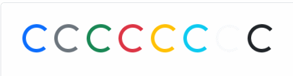
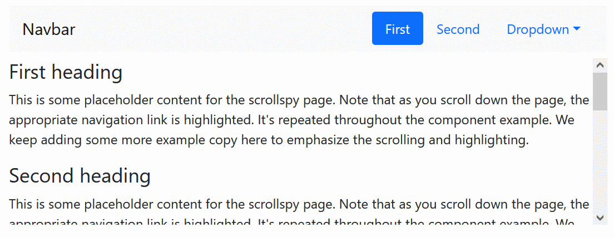

# 16BoostrapYValidaciones

## 1.Parte 1. Investigación
Crea una presentación de bootstrap que solvente las siguientes cuestiones:

### ¿Hay muchos tipos de diseños en Bootstrap? Si los hay, explícalos

Tipos de diseño se puede entender de distintos modos.

    * Diseño responsive o diseño no responsive. Actualmente, es poco usual crear un diseño no adaptable a la pantalla. Bootstrap está pensado para facilitar diseños responsive, gracias a las clases que tienen variantes según puntos de ruptura.
    * Diseño mobile-first o desktop-first. En principio, Bootstrap está diseñado como mobile-first, de forma que su carga en móviles sea algo más eficiente.


### ¿Cuáles son los diferentes tipos de botones en bootstrap? Pon ejemplos.

https://getbootstrap.com/docs/5.1/components/buttons/

Uno de los componentes más usados en la webs son los botones.
Los botones predefinidos de BS tienen un color liso de fondo y un borde redondeado (además de cierto padding y margen). También tienen efectos de hover con cambio de color y de click con un borde especial.

Los botones pueden usar los colores predefinidos como `primary, secondary, success, danger, warning, info, light`. Por otro lado, hay otro tipo de botón `link`, con el texto azul subrayado.
```
<button type="button" class="btn btn-primary">Primary</button>
```


La clase `btn` y las demás, se puede aplicar a distintos tipos de elementos, como `button, a, input`.

Otro tipo formato de botones son los `outline buttons`, con un fondo blanco y un borde del color indicado.

El tamaño de los botones se puede ajustar con las clases `btn-lg` (botón grande) y `btn-sm` (botón pequeño).

Los botones también tienen un color más claro en caso de estar deshabilitados.


### ¿Que es un Carousel de bootstrap? Pon un ejemplo

https://getbootstrap.com/docs/5.1/components/carousel/

Un carrusel es un componente de BS con una serie de elementos que van apareciendo formando un ciclo. Se usa (o mejor, se usaba) a menudo como primer elemento visual en las webs, aunque las últimas tendencias tienen a eliminarlo por su escasa utilidad.
Los elementos habitualmente incluyen imágenes y/o texto.

```
<div id="carouselExampleSlidesOnly" class="carousel slide" data-bs-ride="carousel">
  <div class="carousel-inner">
    <div class="carousel-item active">
      
    </div>
    <div class="carousel-item">
      
    </div>
    <div class="carousel-item">
      
    </div>
  </div>
</div>
```


### ¿Que es un spinner de bootstrap? Pon un ejemplo
Un spinner es un componente de BS usado para indicarle al usuario/a que se está realizando algún proceso internamente y que debe esperar.
Existen dos tipos de spinners en BS, los border spinner, que giran sobre sí mismos, y los growing spinner.
Se pueden cambiar los colores y los tamaños.

Ejemplos:

 

Se pueden añadir detalles para los lectores de pantalla que ayudan a personas con limitaciones de visión:

```
<div class="spinner-border" role="status">
  <span class="visually-hidden">Loading...</span>
</div>
```


### ¿Que es un navBar de bootstrap? Pon un ejemplo
https://getbootstrap.com/docs/5.1/components/navbar/

Los navBar son barras de navegación, como se encuentran frecuentemente en las webs con diversidad de contenido. Incluyen botones para acceder a las distintas partes de la web.
También pueden incluir un logo o nombre y botones desplegables con más opciones (incluso desplegables anidados).

Las barras de navegación suelen fijarse a la parte superior de la pantalla (aunque a veces se encuentran en la parte inferior), y en pantallas pequeñas suelen esconder sus botones y mostrar solo un botón de tipo hamburguesa para desplegarlas.


Ejemplo de: https://www.w3schools.com/bootstrap5/bootstrap_navbar.php

```
 <!-- A grey horizontal navbar that becomes vertical on small screens -->
<nav class="navbar navbar-expand-sm bg-light">

  <div class="container-fluid">
    <!-- Links -->
    <ul class="navbar-nav">
      <li class="nav-item">
        <a class="nav-link" href="#">Link 1</a>
      </li>
      <li class="nav-item">
        <a class="nav-link" href="#">Link 2</a>
      </li>
      <li class="nav-item">
        <a class="nav-link" href="#">Link 3</a>
      </li>
    </ul>
  </div>

</nav>
```


### ¿Que es un modal de bootstrap? Pon un ejemplo
https://getbootstrap.com/docs/5.1/components/modal/


Un modal es un componente de BS que muestra una ventana por encima del contenido de la página. Se utiliza para presentar información, texto, imágenes, opciones y hasta formularios.
Las ventanas modal no permiten la interacción con los otros elementos de la página mientras se están mostrando. Pueden, por ejemplo, desaparecer si se hace clic fuera de ellas, o bien impedir que se realice ninguna acción hasta que se cierre la ventana (con botónes específicos para cerrrarla).

Ejemplo de:
https://www.w3schools.com/bootstrap5/bootstrap_modal.php
```
<!-- Button to Open the Modal -->
<button type="button" class="btn btn-primary" data-bs-toggle="modal" data-bs-target="#myModal">
  Open modal
</button>

<!-- The Modal -->
<div class="modal" id="myModal">
  <div class="modal-dialog">
    <div class="modal-content">

      <!-- Modal Header -->
      <div class="modal-header">
        <h4 class="modal-title">Modal Heading</h4>
        <button type="button" class="btn-close" data-bs-dismiss="modal"></button>
      </div>

      <!-- Modal body -->
      <div class="modal-body">
        Modal body..
      </div>

      <!-- Modal footer -->
      <div class="modal-footer">
        <button type="button" class="btn btn-danger" data-bs-dismiss="modal">Close</button>
      </div>

    </div>
  </div>
</div>
```


### Existen inputs para subir archivos en Bootstrap? Pon un ejemplo
https://getbootstrap.com/docs/5.1/forms/form-control/#file-input

En HTML existe un tipo de input para subir archivos: `<input type="file" ...>`, que, por defecto, ocupa un espacio muy distinto según navegadores y lenguas utilizadas.

BS permite formatear de forma elegante los inputs para cargar archivos de distintos tipos.


```
<div class="mb-3">
  <label for="formFile" class="form-label">Default file input example</label>
  <input class="form-control" type="file" id="formFile">
</div>
```


### ¿Qué es un plugin scrollspy en Bootstrap? Pon un ejemplo
https://getbootstrap.com/docs/5.1/components/scrollspy/

El "scrollspy" permite "espiar" el scroll que el usuario hace sobre el contenido de la página, para que se active en la barra de navegación (u otro conjunto de botones) el botón que corresponde al contenido mostrado en ese momento en pantalla.

Los botones activos en una barra de navegación suelen estar destacados con un color más brillante, un borde o un fondo distinto a los botones situados a su lado.




### Extra
### Implementa nuevos puntos sobre bootstrap que hayas descubierto durante tu investigación y creas que son importantes


